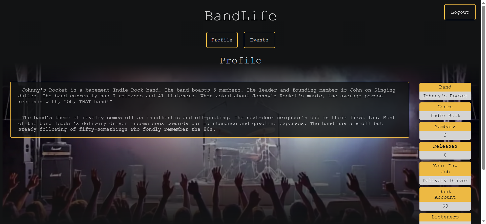
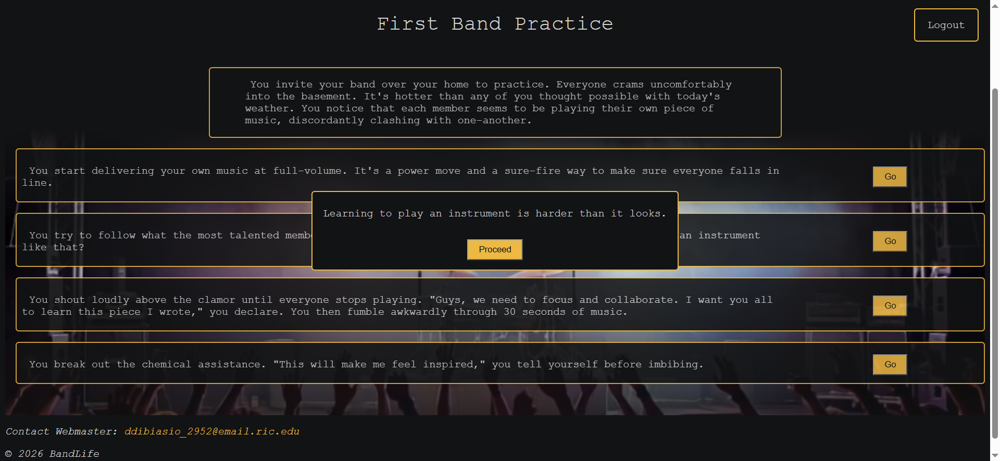

# BandLife

BandLife is a browser-based, single-player text adventure in which players form a band and make decisions that shape their career.

Players encounter events with multiple choices. Each choice produces an outcome and can modify profile attributes such as band membership, employment, income, popularity, and listeners.

The project is inspired by the decision-based gameplay of *NationStates*, adapted into a single-player experience centered on the challenges and opportunities of life as a musician.

## Current Features

* User registration, login, and logout
* Cookie-based authentication with ASP.NET Core Identity
* Role-based authorization for users, moderators, and administrators
* Persistent user profiles stored in SQL Server
* Event prompts with multiple selectable options
* Outcomes that are added to the player’s ongoing status history
* Profile changes based on selected event options, including:

  * Band members
  * Employment
  * Job income
  * Band income
  * Popularity
  * Listeners
* Event creation, retrieval, and modification via Moderator / Admin portal
* Protected pages and API endpoints
* Desktop browser-based interface

## Project Demo

The repository includes screenshots and video recordings that demonstrate the portal's interface and core workflows without requiring visitors to configure and run the application locally.

### Demo Images

The [`images`](./DemoContent/images) folder contains screenshots of the user profile, event listings, and event gameplay, as well as shots of the admin portal's add event and modify event pages. These images provide a quick visual overview of the user interface and can be viewed directly through GitHub.






### Demo Videos

The [`videos`](./DemoContent/videos) folder contains recordings that demonstrate interactive features. These videos allow visitors to see how the game is played and how administrators add and modify events.

[User Gameplay and Profile Updates](./DemoContent/videos/gameplay.mp4)

[Admin Add New Event and Modify](./DemoContent/videos/add_modify_event.mp4)


## How Events Work

Each event contains a description and one or more options. Every option has its own outcome and set of profile modifiers.

When a player selects an option:

1. The frontend sends the selected event and option IDs to the API.
2. The backend confirms that the option belongs to the specified event.
3. The option’s modifiers are applied to the authenticated user.
4. The outcome is added to the user’s status history.
5. The updated profile is saved to the database.

This validation and profile-update logic is handled by the backend so that users cannot directly manipulate their profile values through the browser.

## Tech Stack

### Frontend

* HTML5
* CSS3
* JavaScript
* ES modules
* Fetch API

### Backend

* C#
* ASP.NET Core Web API
* ASP.NET Core Identity
* Entity Framework Core
* Role-based authorization

### Database

* Microsoft SQL Server
* Entity Framework Core migrations

### Development Tools

* Visual Studio
* Swagger / OpenAPI
* SQL Server Management Studio
* Git and GitHub

## Data Model

The event system uses a parent-child relationship:

* An `Event` represents the scenario presented to the player.
* An `EventOption` represents one possible response and its resulting modifiers.
* Each event can contain multiple event options.
* Each event option belongs to one event.

User accounts are managed through ASP.NET Core Identity and extended with game-specific profile properties.

## Project Structure

```text
BandLife/
├── Authorization/     Role definitions
├── Controllers/       API controllers and endpoint logic
├── Data/              Entity Framework Core database context and configuration
├── Migrations/        Entity Framework Core database migrations
├── Models/
│ ├── Domain/          Database entities and domain models
│ └── DTOs/            API request and response models
│     └── Events/      Event creation, update, and response DTOs
├── ProtectedPages/    Pages restricted by authentication or user role
├── Services/          Contains logic for applying weekly modifiers
├── Sql/               SQL scripts and database-related resources
├── wwwroot/
│   ├── assets/        Icons and images
│   ├── css/           Stylesheets
│   ├── js/            JavaScript modules
│   ├── pages/         Application pages
│   └── templates/     Template pages
├── Program.cs         Application configuration
└── appsettings.json   Application and database settings
```

The exact folder names may vary as development continues.

## Getting Started

### Prerequisites

To run BandLife locally, you will need:

* .NET 10 SDK
* Microsoft SQL Server 22
* SQL Server Management Studio or another SQL client
* A modern web browser
* Git

### Installation

1. Clone the repository:

```bash
git clone https://github.com/ddibiasio2952/bandlife.git
```

2. Import the database backup file

Import database.bak from Bandlife\Sql


3. Update the database connection string in `appsettings.json`:

```json
{
  "ConnectionStrings": {
    "DefaultConnectionString": "Your SQL Server connection string"
  }
}
```

4. Start the application:

```bash
dotnet run
```

5. Open the local HTTPS URL displayed in the terminal.

The exact port may differ depending on the development environment.

6. Register or Log In
   
You can log in with one of the following accounts from the SQL database backup:
* email: adminmail@mail.com, password: Password1 (admin user)
* email: johndoe@mail.com, password: Password1 (regular user)

## API Documentation

When the application is running in the development environment, Swagger can be used to inspect and test the available API endpoints.

Navigate to:

```text
https://localhost:<port>/swagger
```

Some endpoints require an authenticated account or a specific Identity role.

## Project Status

BandLife is currently under active development.

Planned improvements include:

* Additional events and outcomes
* More detailed band progression
* Additional administrative tools
* Further interface and accessibility improvements

## Purpose

BandLife is a portfolio project created to demonstrate experience with:

* Full-stack web development
* REST API design
* Authentication and authorization
* Relational database design
* Entity Framework Core
* Asynchronous JavaScript
* Client-server communication
* Input validation and error handling

## License

All rights reserved.

This repository is provided for portfolio and demonstration purposes. The source code may be viewed, but it may not be copied, modified, redistributed, or used in another project without permission.

### Author
Daniel DiBiasio

[GitHub](https://github.com/ddibiasio2952/)
